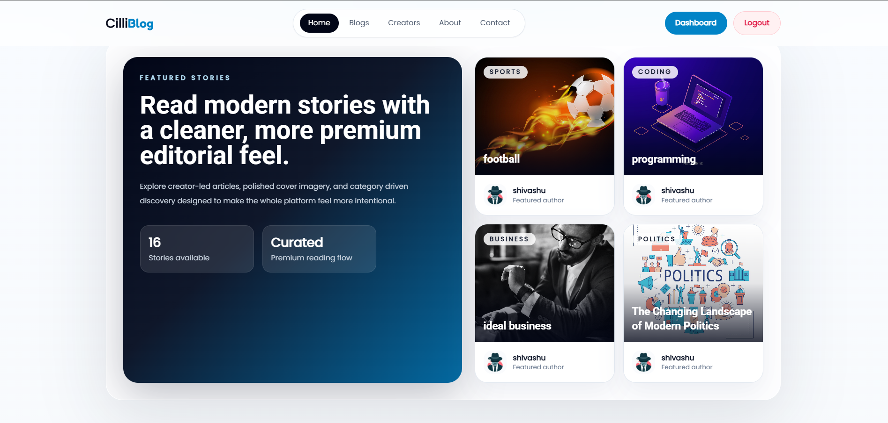

# Blog App

A full-stack blog platform with user authentication, admin blog management, image uploads, and a React dashboard.

## Preview



## Tech Stack

- Frontend: React, Vite, React Router, Tailwind CSS, Axios
- Backend: Node.js, Express, MongoDB, Mongoose
- Auth: JWT, cookies
- Media: Cloudinary

## Features

- User registration and login
- Role-based access for `user` and `admin`
- Admin-only blog creation, update, and delete
- Blog listing and single blog detail view
- Creator/admin listing
- Profile fetch for logged-in users
- Image upload support for user photos and blog covers

## Project Structure

```text
Blog app/
|-- backend/
|-- frontend/
`-- vercel.json
```

## Local Setup

### 1. Clone and install dependencies

```bash
git clone <your-repo-url>
cd "Blog app"
cd backend && npm install
cd ../frontend && npm install
```

### 2. Configure backend environment

Create `backend/.env` and add:

```env
PORT=4001
MONOG_URI=your_mongodb_connection_string
FRONTEND_URL=http://localhost:5173
JWT_SECRET_KEY=your_jwt_secret
CLOUD_NAME=your_cloudinary_cloud_name
CLOUD_API_KEY=your_cloudinary_api_key
CLOUD_SECRET_KEY=your_cloudinary_api_secret
```

### 3. Start the backend

```bash
cd backend
npm start
```

### 4. Start the frontend

```bash
cd frontend
npm run dev
```

Frontend runs on `http://localhost:5173` and the backend is expected on `http://localhost:4001`.

## API Overview

### User routes

- `POST /api/users/register`
- `POST /api/users/login`
- `GET /api/users/logout`
- `GET /api/users/my-profile`
- `GET /api/users/admins`

### Blog routes

- `GET /api/blogs/all-blogs`
- `GET /api/blogs/single-blog/:id`
- `GET /api/blogs/my-blog`
- `POST /api/blogs/create`
- `PUT /api/blogs/update/:id`
- `DELETE /api/blogs/delete/:id`

## Notes

- The frontend currently uses a deployed backend URL in `frontend/src/utils.js`.
- Protected routes rely on JWT cookies and local storage token checks.
- Blog and user image uploads require valid Cloudinary credentials.
